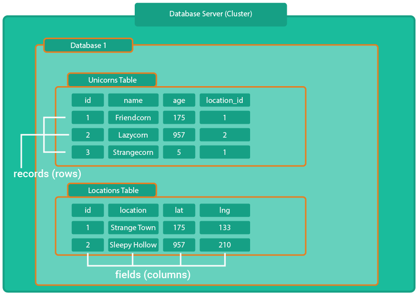
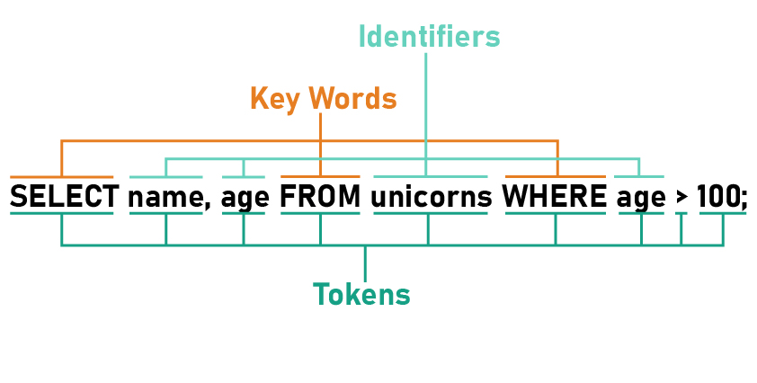

# SQL

- [What is SQL](#what-is-sql)
- [Core Syntax](#core-syntax)

---

## What is SQL

SQL stands for Structured Query Language, and it is needed to communicate with data in a database. SQL is a relational database language.  Besides SQL there are also non-relational database languages like MongoDB for example.

> SQL is typically used for managing data in relational database management systems (RDBMS). In these, data can be stored in a tabular structure. Individual tables can in turn be linked to each other.

### **Unicorns:**

| id  | name        | age | location_id |
| --- | ----------- | --- | ----------: |
| 1   | Friendcorn  | 175 |           1 |
| 2   | Lazycorn    | 957 |           2 |
| 3   | Strangecorn | 5   |           1 |

### **Locations:**

| id  | location          | lat | lng |
| --- | ------------- | --- | --: |
| 1   | Strange Town  | 175 |  33 |
| 2   | Sleepy Hollow | 55  | 199 |

SQL is the language that communicates with a database. An RDBMS is the database system itself. There are two well-known database systems MySQL or PostgreSQL for example.

---

## Core Syntax

The syntax in SQL is subdivided into predefined key words,
these are for example SELECT FROM WHERE.
The identifiers result from the different columns in the table.

**Syntax Rules:**
1. SQL statements must end with a semicolon (if more than one statement in the same command).
2. SQL statements are case-insensitive. That means *FROM* is the same then *from* (To better identify the keywords, they should still be capitalized).
3. Identifiers can be surrounded with double quotes to avoid clashes with build-in keywords.